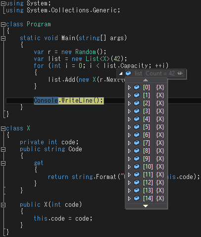
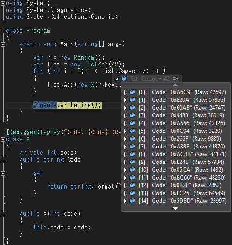

ブレークポイントで停止した際にインスタンス一つ確認するくらいならマウスをホバーして表示すれば良いが、リストの中身を一つずつホバーしていくのはかなり辛い(現在進行系で辛い)。

`ToString()` をオーバーライドしてもそれっぽくなるが、デバッグのためのメソッドじゃないだろということで後述する `DebuggerDisplay` 属性を使用したい。

## デフォルト表示だと何が困るか？
以下のソースをサンプルとする。
```cs
using System;
using System.Collections.Generic;

class Program
{
    static void Main(string[] args)
    {
        var r = new Random();
        var list = new List<X>(42);
        for (int i = 0; i < list.Capacity; ++i)
        {
            list.Add(new X(r.Next(0xFFFF)));
        }

        Console.WriteLine();
    }
}

class X
{
    private int code;
    public string Code
    {
        get
        {
            return string.Format("0x{0:X4}", this.code);
        }
    }

    public X(int code)
    {
        this.code = code;
    }
}
```
上記のコードの `Main` 関数の最後でブレークし、`list` 変数にマウスカーソルを重ねると以下のポップアップウィンドウが表示される。



`DebuggerDisplayAttribute` 属性が設定されておらず `ToString()` もオーバーライドされていない場合、
クラス名を表示してしまうため中の値を確認するためには一々閉じている項目を展開しなければならない。

## DebuggerDisplay 属性
`System.Diagnostics.DebuggerDisplayAttribute` をクラスに付与することでポップアップウィンドウでの表示が見やすくなる。

上記のサンプルに以下の修正を加える。
```diff
 using System;
 using System.Collections.Generic;
+using System.Diagnostics;

 class Program
 {
```

```diff
     }
 }

+[DebuggerDisplay("Code: {Code} (Raw: {code})")]
 class X
 {
     private int code;
```
同様の操作をした場合の表示が変化する。


## オプション
表示方法に関しては
[https://learn.microsoft.com/ja-jp/visualstudio/debugger/using-the-debuggerdisplay-attribute?view=vs-2022](https://learn.microsoft.com/ja-jp/visualstudio/debugger/using-the-debuggerdisplay-attribute?view=vs-2022) を参照。
