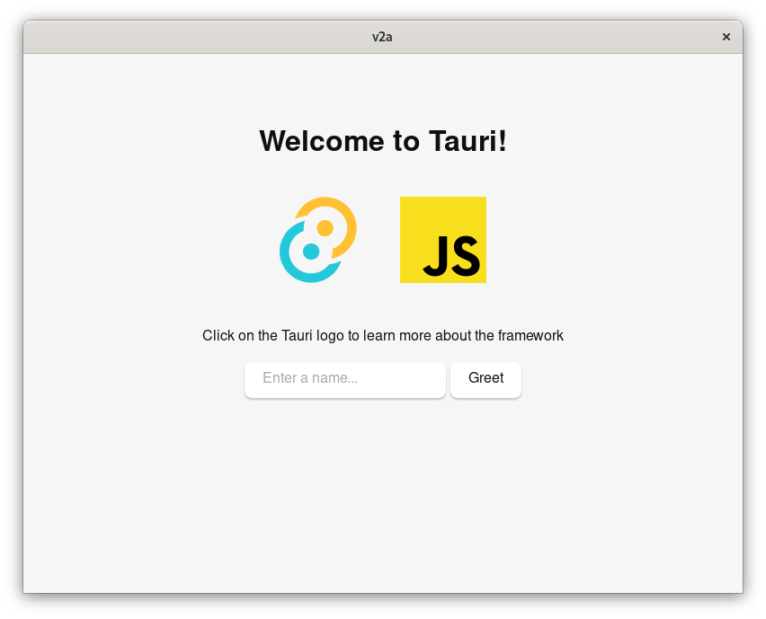
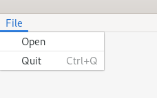
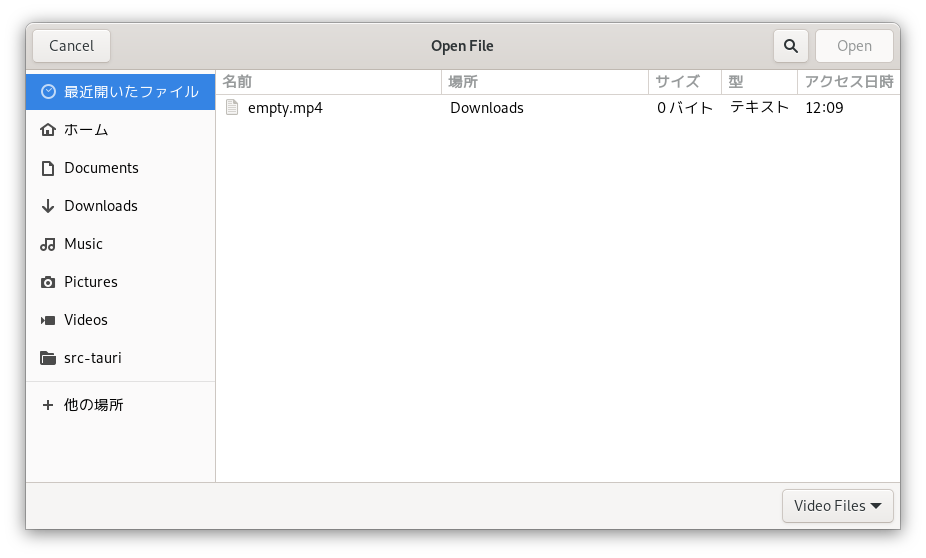
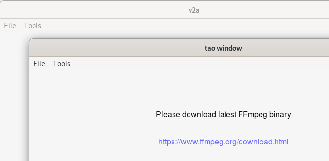
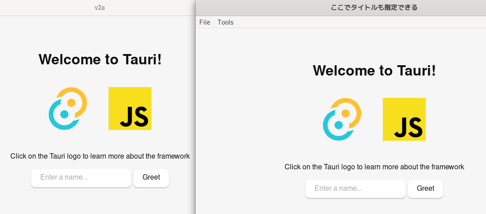
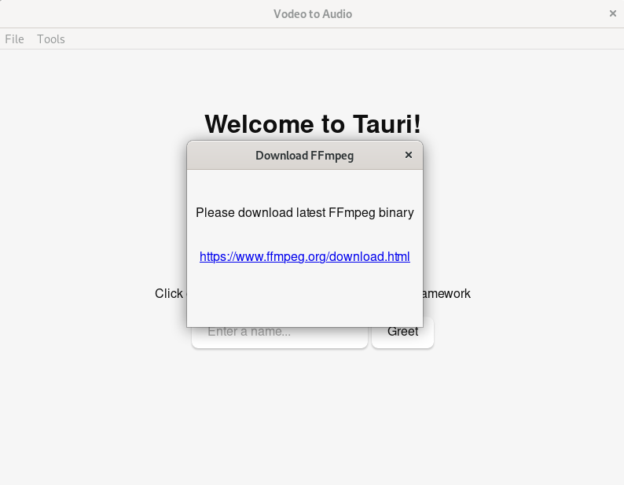

# tauri を簡単な GUI アプリケーションを作る(途中)

映像ファイルから音声を抽出して保存したい。  
ffmpeg を使えばいいのだが、非エンジニアの Windows ユーザは CLI を知らない(主語がでかい)。

ffmpeg の使い方とパラメータのサンプルを渡しても敬遠されるので GUI アプリケーションを作ることにした。

Windows GUI といえば C# で Windows Forms を使うしか脳が無かったが、もうそのような時代ではないので tauri。  
tauri を使って映像ファイルから音声を抽出して保存するアプリケーションを作ってみる。  



## プロジェクトの雛形作成
昔は npm からやった記憶があるが、今回は cargo からプロジェクトを作成してみる。
以下のコマンドでツールをインストールする。
```sh
$ cargo install create-tauri-app --locked
```

アプリ名は Video to Audio、`V2A` でいいだろう(安直)。  
よくわからんが Frontend は Rust を選択する。俺は Rust を書きたいんだ。
```sh
$ cargo create-tauri-app
✔ Project name · v2a
✔ Choose which language to use for your frontend · Rust - (cargo)
✔ Choose your UI template · Vanilla

Template created!

Your system is missing dependencies (or they do not exist in $PATH):
╭───────┬──────────────────────────────────────────────────────────────────────────────────╮
│ rsvg2 │ Visit https://tauri.app/v1/guides/getting-started/prerequisites#setting-up-linux │
╰───────┴──────────────────────────────────────────────────────────────────────────────────╯

Make sure you have installed the prerequisites for your OS: https://tauri.app/v1/guides/getting-started/prerequisites, then run:
  cd v2a
  cargo tauri dev
```

とりあえず指示に従う。
```sh
$ cd v2a
$ cargo tauri dev
```

Welcome to Tauri の画面が表示された。



## メニューバー
オールドタイプなのでメニューバーから映像ファイルを選択したい。  

ファイル選択ダイアログ(Windows Forms の `System.Windows.Forms.OpenFileDialog`)を利用するには `Cargo.toml` で dialog-all feature を指定する必要がある。  

```diff
- tauri = { version = "1.5", features = ["shell-open"]
+ tauri = { version = "1.5", features = ["shell-open", "dialog-all"]
```
あと、`src-tauri/src/tauri.conf.json` でダイアログを出すことを許可する必要があるらしい。

```diff
      "allowlist": {
        "all": false,
        "shell": {
          "all": false,
          "open": true
+       },
+       "dialog": {
+         "all": false,
+         "open": true
        }
      },
```

そしてメニューを作るコードを書く。Windows Forms の `System.Windows.Forms.MenuStrip` だ。  
Windows Forms だと各 MenuItem 毎に Click イベントを追加した記憶があるが、  
tauri では MenuStrip に Click イベントを追加する。

個人的にメニューの構成(?)とクリック時の処理は近い場所で定義したいので、それらを保持する構造体を用意した。

```rs
use std::marker::PhantomData;
use tauri::api::dialog;
use tauri::{CustomMenuItem, Menu, MenuItem, Submenu};

// V2A のメニューとクリック時のイベントを保持する構造体
struct V2AMenu<R: tauri::Runtime, F: Fn(tauri::WindowMenuEvent<R>) + Send + Sync + 'static> {
    menu: Menu,
    on_menu_event: F,
    _1: PhantomData<R>,
}

fn make_v2a_menu<R: tauri::Runtime>() -> V2AMenu<R, impl Fn(tauri::WindowMenuEvent<R>)> {
    // メニューの構成の定義
    let open = CustomMenuItem::new("menu_open", "Open");
    let file = Submenu::new(
        "File",
        Menu::new()
            .add_item(open)
            .add_native_item(MenuItem::Separator)
            .add_native_item(MenuItem::Quit),
    );
    let menu = Menu::new().add_submenu(file);
    
    // クリック時の処理の定義
    let on_menu_event = |e: tauri::WindowMenuEvent<R>| match e.menu_item_id() {
        "menu_open" => {
            dialog::FileDialogBuilder::default()
                .add_filter("Video Files", &["mp4"])
                .pick_file(|p| match p {
                    Some(p) => println!("File: {}", p.display()),
                    None => println!("Cancel"),
                });
        }
        _ => (),
    };

    V2AMenu {
        menu,
        on_menu_event,
        _1: PhantomData,
    }
}
```
そしてこいつを `main` 関数から呼んでやる。

```rs
fn main() {
    let m = make_v2a_menu();
    tauri::Builder::default()
        .menu(m.menu)
        .on_menu_event(m.on_menu_event)
        .run(tauri::generate_context!())
        .expect("error while running tauri application");
}
```

実行すると  
```sh
$ cargo tauri dev
```

メニューが表示され  


ファイルを選択できることが確認できる。  


## FFmpeg ダウンロードページへの誘導
FFmpeg のバイナリ込みで配布するのは宜しくない感じがするので、ユーザにダウンロードさせたい。  
そのためのダウンロードページを表示する画面を作成する。  
メイン画面とは他の別画面。つまりマルチウィンドウを試す。

適当に↓な html を作成し、

```html
<!doctype html>
<html lang="en">

<head>
    <meta charset="UTF-8" />
    <link rel="stylesheet" href="styles.css" />
    <meta name="viewport" content="width=device-width, initial-scale=1.0" />
    <title>Download FFmpeg</title>
</head>

<body>
    <div class="container">
        <p>Please download latest FFmpeg binary</p>
        <p><a href="https://www.ffmpeg.org/download.html" target="_blank">https://www.ffmpeg.org/download.html</a></p>
    </div>
</body>

</html>
```
とりあえず複数ウィンドウでるかを確認したいので、前回作成した main 関数に呼び出し処理を作ってやる。

```diff
  fn main() {
      let m = make_v2a_menu();
      tauri::Builder::default()
          .menu(m.menu)
+         .setup(|app| {
+             let _dd = tauri::WindowBuilder::new(
+                 app,
+                 "ffmpeg_dl",
+                 tauri::WindowUrl::App("ffmpeg_dl.html".into()),
+             )
+             .build()?;
+             Ok(())
+         })
          .on_menu_event(m.on_menu_event)
          .run(tauri::generate_context!())
          .expect("error while running tauri application");
  }
```

想定通りウィンドウが複数表示された。  
が、新しいウィンドウにメニューバーは不要だ。


どうも以下のコードだとアプリケーション全ての画面にメニューが表示されてしまうようだ。  
特定のウィンドウだけにメニューを設定しないといけない。
```rs
    tauri::Builder::default()
        .menu(m.menu)
```

というわけで、明示的にウィンドウを生成してそいつにメニューを設定する。  
```rs
fn main() {
    let m = make_v2a_menu();
    tauri::Builder::default()
        .setup(|app| {
            tauri::WindowBuilder::new(
                app,
                "main_window",
                tauri::WindowUrl::App("index.html".into()),
            )
            .menu(m.menu)
            .title("ここでタイトルも指定できる")
            .build()?;
            Ok(())
        })
        .on_menu_event(m.on_menu_event)
        .run(tauri::generate_context!())
        .expect("error while building tauri application");
}
```
確かにメニューは意図した画面で表示されているが、メインウィンドウが 2 枚表示されている。  
どこから出てきたお前は。


どうやら `tauri.conf.json` の `tauri.windows` に定義されている項目は Static window として表示されるらしい。  
ので、消す。
```diff
      "windows": [
-       {
-         "fullscreen": false,
-         "resizable": true,
-         "title": "v2a",
-         "width": 800,
-         "height": 600
-       }
      ],
```
これでメインウィンドウが 2 枚表示される問題は解決した。

後は前項で作成したした `make_v2a_menu` にこんな感じで `Tools` メニューと FFmpeg ダウンロード画面開く用のサブメニューの定義を追加し、
```rs
let ffmpeg = CustomMenuItem::new("ffmpeg_page", "Download FFmpeg");
let tools = Submenu::new("Tools", Menu::new().add_item(ffmpeg));
let menu = Menu::new().add_submenu(file).add_submenu(tools);
```
```rs
"ffmpeg_page" => {
    let handle = e.window().app_handle();
    tauri::WindowBuilder::new(
        &handle,
        "ffmpeg_dl",
        tauri::WindowUrl::App("ffmpeg_dl.html".into()),
    )
    .title("Download FFmpeg")
    .resizable(false)
    .center()
    .inner_size(300.0, 200.0)
    .build()
    .unwrap();
}
```
実行すると Tools > Download FFmpeg で新しいウィンドウが表示される。  


今回はここまでで暇な時に続きをやる。

## 残件

* ffmpeg へのパス設定画面
* 出力形式の選択
* ffmpeg 呼び出し処理
* 出力に関する他のパラメータ選択

## 履歴
2024-02-06 雛形、メニューバーの項を追加 (rustc 1.75.0 (82e1608df 2023-12-21))  
2024-02-14 FFmpeg ダウンロードページへの誘導の項を追加
